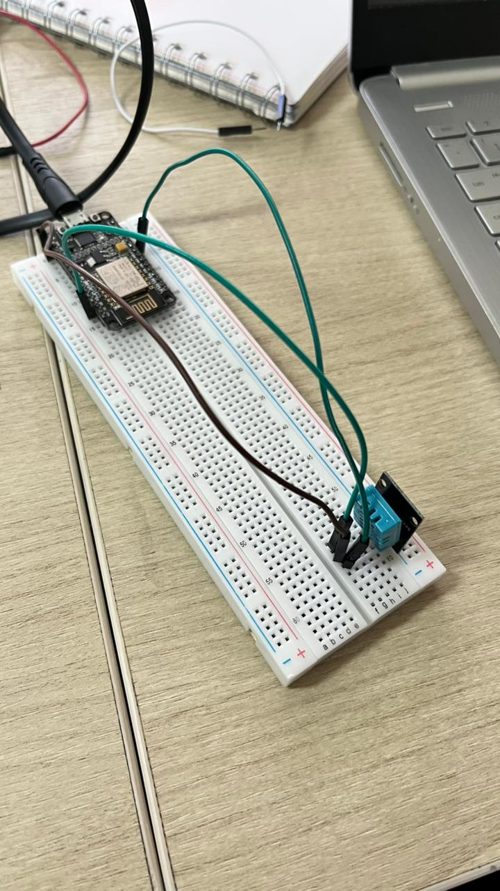
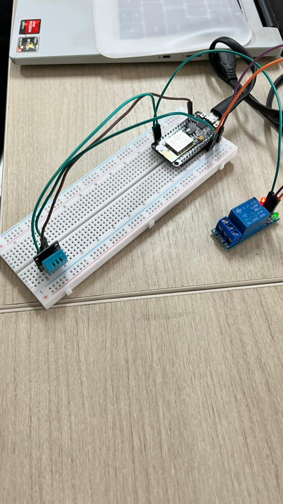

# Kendali Aktuator Relay dengan Histerisis (Dua Ambang Batas) — DHT11 + ESP32/NodeMCU

**Mata Kuliah:** Praktikum IoT (TK245005)
**Modul:** 1 — Akuisisi Data Sensor & Kendali Aktuator
**Nama Praktikan / NIM:** Finda Wulan Febrianti / H1H024055
**Nama Asisten / NIM:** Imedia Sholem Shoukat / H1D023088

---

## 1. Deskripsi Singkat

Program ini adalah pengembangan dari Percobaan 2A (kendali aktuator berbasis satu threshold suhu). Pada versi ini, logika kendali diganti menjadi **histerisis dua ambang batas**, agar aktuator (relay/LED) tidak menyala-mati berulang kali (chattering) saat suhu berosilasi di sekitar nilai ambang tunggal.

- Aktuator **menyala** ketika suhu naik melewati **30°C**
- Aktuator **baru mati** ketika suhu turun di bawah **28°C**
- Selama suhu berada di antara 28°C dan 30°C, status aktuator **dipertahankan** (tidak berubah)

## 2. Dokumentasi Rangkaian

### Percobaan 1A — Akuisisi Data Sensor DHT11
Sensor DHT11 terhubung ke GPIO 4 pada NodeMCU.



### Percobaan 2A — Kendali Aktuator Relay Berdasarkan Data Sensor
Pengembangan dari rangkaian 1A dengan penambahan modul relay/LED. Pin kendali relay/LED terhubung ke GPIO 5 melalui resistor pembatas arus.



## 3. Kode Program

```cpp
#include <DHT.h>
#define DHTPIN 4
#define DHTTYPE DHT11
#define RELAYPIN 5

DHT dht(DHTPIN, DHTTYPE);

// -- Tambahan: dua ambang batas menggantikan satu threshold --
const float batasNyala = 30.0;   // di atas nilai ini aktuator dinyalakan
const float batasMati  = 28.0;   // di bawah nilai ini aktuator dimatikan
bool statusRelay = false;        // status aktuator tersimpan antar-loop

void setup() {
  Serial.begin(115200);
  dht.begin();
  pinMode(RELAYPIN, OUTPUT);
  digitalWrite(RELAYPIN, LOW);
  statusRelay = false;
}

void loop() {
  float suhu = dht.readTemperature();

  if (isnan(suhu)) {
    Serial.println("Gagal membaca suhu, status aktuator dipertahankan.");
  } else {
    // -- Tambahan: logika histerisis --
    if (suhu > batasNyala) {
      statusRelay = true;        // suhu tinggi -> pastikan menyala
    } else if (suhu < batasMati) {
      statusRelay = false;       // suhu rendah -> pastikan mati
    }
    // jika suhu berada di antara batasMati dan batasNyala,
    // statusRelay TIDAK diubah -> inilah efek histerisis

    digitalWrite(RELAYPIN, statusRelay ? HIGH : LOW);

    Serial.print("Suhu: ");
    Serial.print(suhu);
    Serial.print(" °C, Aktuator: ");
    Serial.println(statusRelay ? "ON" : "OFF");
  }

  delay(2000);
}
```

## 4. Penjelasan per Baris

| Baris / Bagian | Penjelasan |
|---|---|
| `#define RELAYPIN 5` | Menentukan pin output GPIO 5 yang dipakai untuk mengendalikan relay/LED. |
| `const float batasNyala = 30.0;` | Ambang atas — begitu suhu **melewati** nilai ini, aktuator diperintahkan menyala. |
| `const float batasMati = 28.0;` | Ambang bawah — begitu suhu **turun di bawah** nilai ini, aktuator diperintahkan mati. Nilainya sengaja dibuat lebih rendah dari `batasNyala` untuk menciptakan "jarak aman" (zona histerisis). |
| `bool statusRelay = false;` | Variabel global yang menyimpan status aktuator saat ini (ON/OFF) agar nilainya tetap konsisten antar-iterasi `loop()`, bukan dihitung ulang dari nol setiap saat. |
| `pinMode(RELAYPIN, OUTPUT);` | Mengatur pin GPIO 5 sebagai output digital. |
| `digitalWrite(RELAYPIN, LOW); statusRelay = false;` | Memastikan aktuator dalam kondisi mati saat program baru dijalankan (kondisi awal yang aman). |
| `float suhu = dht.readTemperature();` | Membaca nilai suhu terkini dari sensor DHT11. |
| `if (isnan(suhu))` | Validasi data — kalau pembacaan gagal (NaN), program tidak mengubah status aktuator, cukup menampilkan peringatan. Ini mencegah keputusan kendali diambil dari data yang tidak valid. |
| `if (suhu > batasNyala) { statusRelay = true; }` | Kalau suhu melewati ambang atas, aktuator dipastikan menyala. |
| `else if (suhu < batasMati) { statusRelay = false; }` | Kalau suhu turun di bawah ambang bawah, aktuator dipastikan mati. |
| *(tanpa else lanjutan)* | Kalau suhu berada di **zona tengah** (28°C–30°C), tidak ada baris yang mengubah `statusRelay` — inilah inti dari histerisis: status lama dipertahankan. |
| `digitalWrite(RELAYPIN, statusRelay ? HIGH : LOW);` | Menerapkan status logis `statusRelay` ke pin fisik relay/LED. |
| `Serial.print(...)` | Menampilkan nilai suhu dan status aktuator ke Serial Monitor agar hubungan sebab-akibatnya terlihat jelas. |
| `delay(2000);` | Jeda wajib antar pembacaan, sesuai keterbatasan sampling internal sensor DHT11 (±2 detik). |

## 5. Mengapa Histerisis Diperlukan?

Pada kendali satu threshold, status aktuator langsung berubah setiap kali suhu melintasi batas tunggal, sehingga jika suhu berosilasi tepat di sekitar nilai threshold, aktuator bisa menyala-mati berkali-kali dalam waktu singkat (*chattering*). Dengan dua ambang batas (histerisis), status aktuator hanya berubah saat suhu benar-benar melewati salah satu batas, dan tetap stabil selama suhu berada di zona tengah — sehingga aktuator lebih awet dan responsnya lebih stabil.
